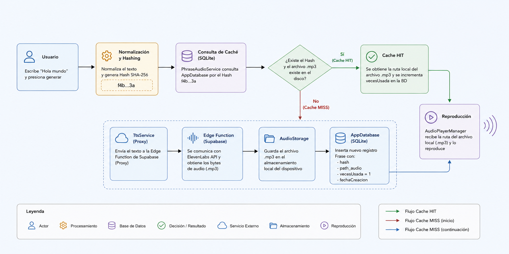

# My Voice TTS

> ⚠️ **Proof of Concept (PoC)**: portfolio project, not production-ready.
>
> **Status:** no longer maintained. The original Supabase Edge Function and ElevenLabs API key have been decommissioned, so running the app requires deploying your own backend (see [Prerequisites](#prerequisites)).

A Flutter mobile app that converts text to speech (TTS) using the ElevenLabs API, with a local caching layer (SQLite + physical files) that avoids regenerating repeated audio and reduces latency and API credit usage.

## Architecture

Clean Architecture split into three layers under `lib/`:

* **`lib/presentation/`** — UI: `HomeScreen` (text input, suggestions, playback), `HistoryScreen` (history) and reusable widgets.
* **`lib/logic/`** — Use cases: `PhraseAudioService` (SHA-256 hashing and Hit/Miss cache logic), `AudioPlayerManager` (playback with `just_audio`), `PhrasesManagerService` / `BuscarSugerencias` (search and suggestions), `AnalyticsService` (local metrics).
* **`lib/data/`** — Persistence: `AppDatabase` (SQLite), `AudioStorage` (`.mp3` files via `path_provider`), `TtsService` (HTTP client to Supabase Edge Functions / ElevenLabs), `Frase` (data model).

### Audio generation flow



1. The user types text or picks an existing suggestion.
2. A SHA-256 hash of the normalized text is computed (or reused).
3. The local cache (`AppDatabase`) is checked:
   * **Cache HIT**: the record and `.mp3` file exist → played locally.
   * **Cache MISS**: missing or the file was deleted → audio is requested from `TtsService`, saved to disk and registered in the database.
4. `AudioPlayerManager` plays the audio gaplessly.

## Prerequisites

* [Flutter SDK](https://docs.flutter.dev/get-started/install) installed.
* A [Supabase](https://supabase.com) project with an Edge Function acting as a proxy to the [ElevenLabs](https://elevenlabs.io) API (the `ELEVENLABS_API_KEY` secret is stored in Supabase secrets, never on the client).

## Clone and run

```bash
# 1. Clone the repository
git clone <repository-url>
cd my_voice_tts_app

# 2. Configure environment variables
cp .env-example .env
# Edit .env and fill in SUPABASE_URL and SUPABASE_ANON_KEY

# 3. Install dependencies
flutter pub get

# 4. Run the app
flutter run
```

## Security note

⚠️ `.env` is bundled as an app asset (see `pubspec.yaml`), so `SUPABASE_URL`/`SUPABASE_ANON_KEY` ship inside the client binary. That's acceptable for this PoC but **not recommended for production** — for a real release, load these values through a secure config mechanism instead of packaging them with the app.

## Current features

* Management and history of generated phrases.
* Suggestions panel based on frequent usage.
* Automatic cache cleanup (files older than 30 days).
* Quick access to recently used phrases.

## Roadmap

* Share audio files.
* Cloud backup/sync.
* On-device speech synthesis.
